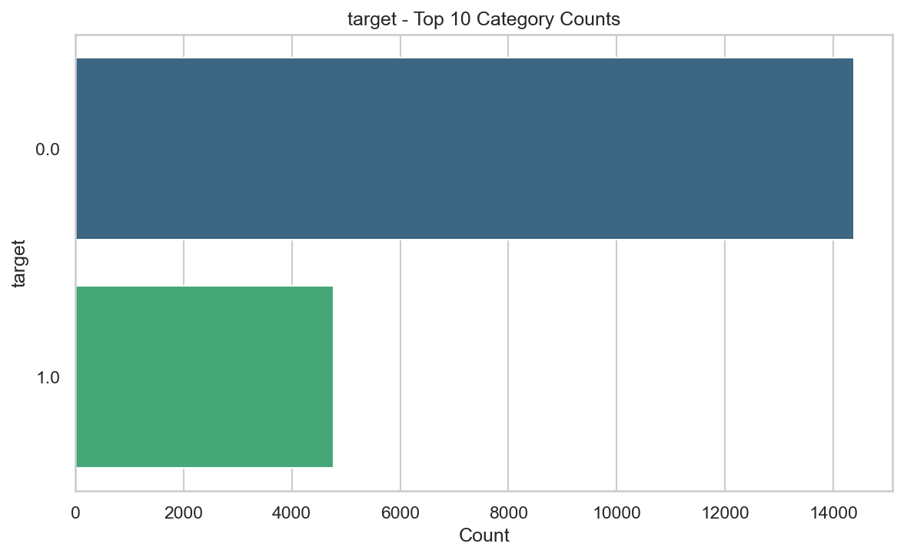
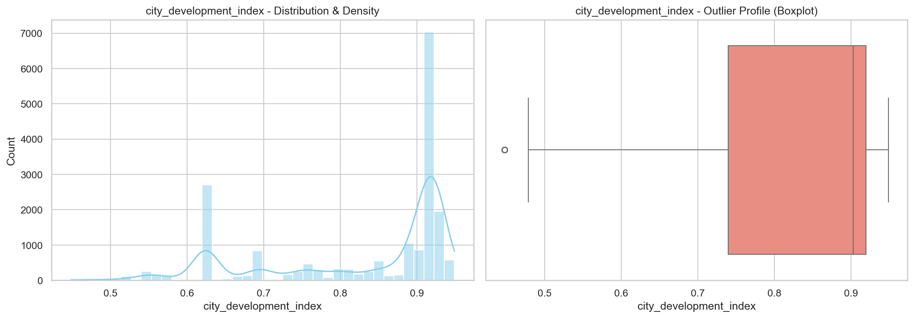
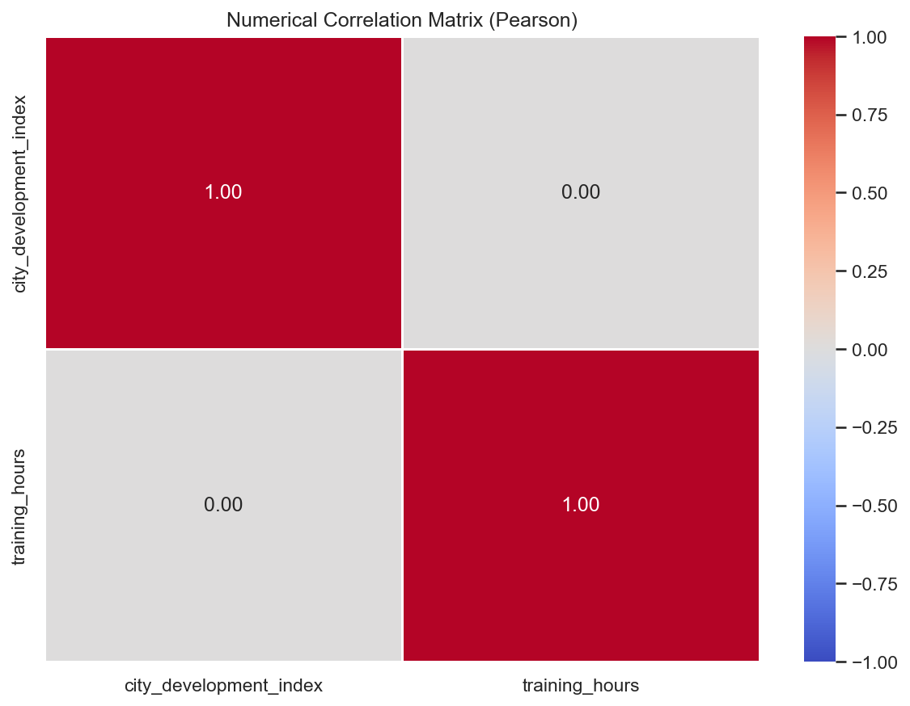

# HR Analytics Dataset Analysis

This repository presents an exploratory analysis of an **HR Analytics** dataset used for employee job change prediction. The dataset contains demographic, educational, professional, and organizational information for candidates, along with a binary target indicating whether an employee is looking for a new job.

The analysis explores workforce composition, educational background, professional experience, company characteristics, and candidate behavior to better understand the population represented in the dataset.

---

## Dataset Overview

The dataset contains information about:

- City and City Development Index
- Gender
- Relevant Experience
- Education Level
- Major Discipline
- Company Type
- Company Size
- Years of Experience
- Last Job Change
- Training Hours
- University Enrollment Status
- Job Change Target

---

# Key Insights

## Target Distribution

The target variable is noticeably imbalanced.

| Target | Meaning | Percentage |
|---------|---------|-----------:|
| 0 | Not looking for a job change | **75.07%** |
| 1 | Looking for a job change | **24.93%** |

### Observation

Most candidates are **not actively seeking a new job**, making the dataset moderately imbalanced for classification tasks.

---

## Professional Experience

Candidates tend to have significant industry experience.

- The largest group has **more than 20 years of experience**.
- Mid-career professionals (3–6 years) also represent a substantial portion of the dataset.

### Observation

The dataset contains a healthy mix of experienced professionals, although senior candidates are slightly more common.

---

## Relevant Experience

| Experience | Percentage |
|------------|-----------:|
| Has Relevant Experience | **71.99%** |
| No Relevant Experience | **28.01%** |

### Observation

Nearly three-fourths of candidates already possess experience relevant to their current field.

---

## Education Level

Education is concentrated around higher education qualifications.

| Education Level | Percentage |
|----------------|-----------:|
| Graduate | **62.03%** |
| Masters | **23.32%** |
| High School | 10.79% |
| PhD | 2.22% |
| Primary School | 1.65% |

### Observation

Most candidates hold at least a graduate degree, while postgraduate qualifications are also well represented.

---

## Major Discipline

The overwhelming majority of candidates come from technical backgrounds.

| Discipline | Percentage |
|------------|-----------:|
| STEM | **88.66%** |
| Humanities | 4.09% |
| Other | 2.33% |
| Business | 2.00% |
| Arts | 1.55% |

### Observation

The workforce is heavily dominated by STEM graduates, making the dataset representative of technical industries.

---

## University Enrollment

| Enrollment Status | Percentage |
|------------------|-----------:|
| Not Enrolled | **73.60%** |
| Full-Time Course | 20.01% |
| Part-Time Course | 6.39% |

### Observation

Most candidates are no longer enrolled in formal education, suggesting the dataset primarily represents working professionals.

---

## Company Type

Private organizations account for the majority of employers.

| Company Type | Percentage |
|-------------|-----------:|
| Private Ltd | **75.41%** |
| Funded Startup | 7.69% |
| Public Sector | 7.33% |
| Early Stage Startup | 4.63% |
| NGO | 4.00% |

### Observation

The dataset largely represents candidates employed in private-sector organizations.

---

## Company Size

The workforce spans organizations of varying sizes.

The largest employer categories are:

- **50–99 employees**
- **100–500 employees**
- **10,000+ employees**

### Observation

Candidates are distributed across both growing companies and large enterprises, providing a diverse organizational profile.

---

## Gender Distribution

The dataset is highly imbalanced with respect to gender.

| Gender | Percentage |
|--------|-----------:|
| Male | **90.25%** |
| Female | 8.45% |
| Other | 1.30% |

### Observation

Male candidates make up the overwhelming majority of the dataset.

---

## Job Change History

The most common response indicates candidates changed jobs **within the last year**.

Other significant groups include:

- More than four years since the last job change
- Two years since the last job change
- Never changed jobs

### Observation

Many professionals appear to change jobs relatively frequently, while a substantial group has remained with the same employer for several years.

---

## City Development Index

The City Development Index is concentrated toward higher values.

- Median value: **0.903**
- Most cities fall between **0.74** and **0.92**
- Very few low-development cities appear in the dataset.

### Observation

Most candidates come from relatively developed urban regions.

---

## Training Hours

Training participation varies considerably across candidates.

| Metric | Value |
|--------|-------:|
| Average | **65.4 hours** |
| Median | **47 hours** |
| Maximum | **336 hours** |

### Observation

Most candidates completed fewer than 100 hours of training, while a smaller group invested significantly more time in professional development.

---

## Correlation Analysis

The numerical correlation between **City Development Index** and **Training Hours** is approximately **0.00**, indicating virtually no linear relationship.

### Observation

The amount of training completed by candidates appears to be independent of the development level of their city.

---

# Data Quality Summary

-  No duplicate records detected.
- Missing values are concentrated in employment-related attributes.

| Feature | Missing Values |
|---------|---------------:|
| Company Type | **32.05%** |
| Company Size | **30.99%** |
| Gender | **23.53%** |
| Major Discipline | **14.68%** |
| Education Level | 2.40% |
| Last New Job | 2.21% |
| Enrolled University | 2.01% |

### Observation

Missing values are primarily associated with company information, suggesting additional preprocessing or imputation would be beneficial before model training.

---

# Overall Findings

- Most candidates are **not actively looking for a new job**.
- The dataset is dominated by **experienced professionals**.
- Nearly **72%** possess relevant industry experience.
- Graduates and STEM professionals form the majority of the workforce.
- Most candidates are employed in **private companies**.
- Medium-sized organizations are the most common employers.
- Candidates predominantly come from **highly developed cities**.
- Training hours show substantial variation but are unrelated to city development.
- Several employment-related features contain a significant proportion of missing values and should be carefully handled during preprocessing.

---

## Conclusion

The HR Analytics dataset provides a comprehensive view of workforce demographics, education, experience, and organizational characteristics. It highlights the dominance of experienced STEM professionals working in private companies, while also revealing class imbalance and missing-value patterns that are important considerations for predictive modeling.