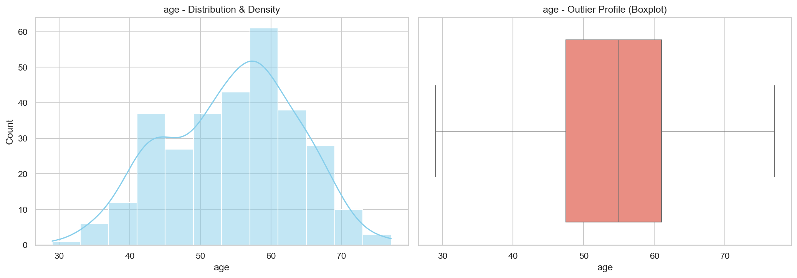
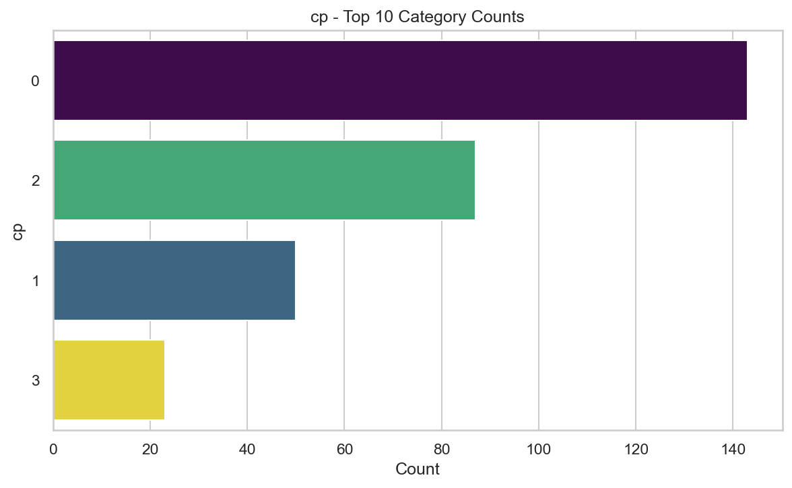
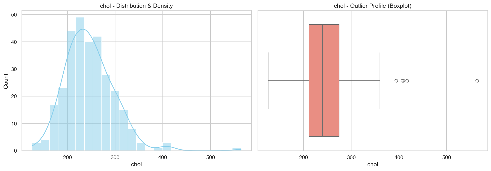
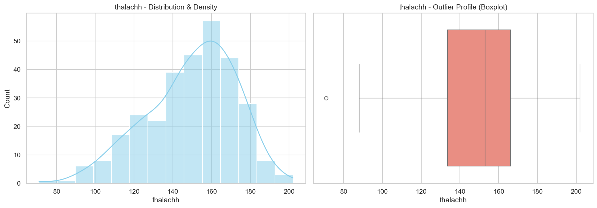
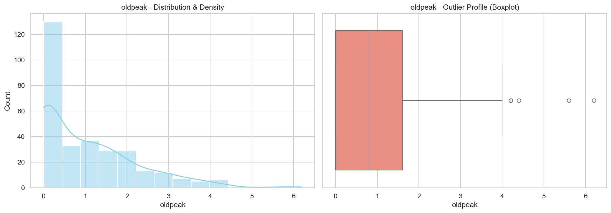
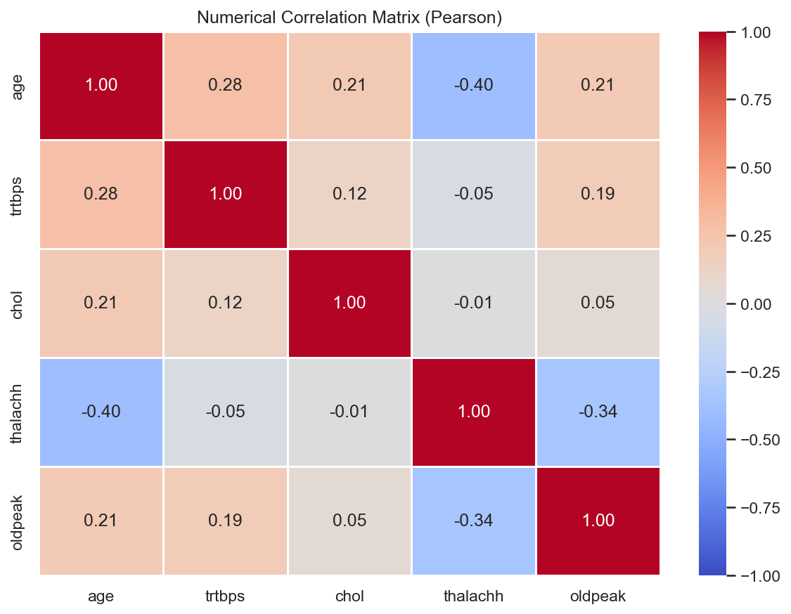

# 🫀 Heart Attack Analysis & Patient Risk Profiling

An exploratory data analysis (EDA) of a cardiovascular disease dataset using **EDAEngine**, a custom Python package for automated data profiling, statistical analysis, visualization, and quality assessment.

The objective of this project is to understand patient demographics, clinical measurements, cardiovascular indicators, and feature relationships before developing machine learning models for heart disease prediction.

---

# Dataset Overview

The dataset contains **303 patient records** and **14 clinical attributes** collected during cardiovascular diagnostic examinations.

## Feature Categories

### Demographics
- Age
- Sex

### Clinical Symptoms
- Chest Pain Type (`cp`)
- Exercise Induced Angina (`exng`)

### Cardiovascular Measurements
- Resting Blood Pressure (`trtbps`)
- Serum Cholesterol (`chol`)
- Maximum Heart Rate Achieved (`thalachh`)

### ECG & Stress Test Indicators
- Resting ECG (`restecg`)
- ST Depression (`oldpeak`)
- ST Segment Slope (`slp`)

### Structural/Cardiac Indicators
- Number of Major Vessels (`caa`)
- Thalassemia (`thall`)

### Target Variable
- Heart Disease Diagnosis (`output`)

---

# Automated EDA Pipeline

This analysis was generated using **EDAEngine**, which automatically performs:

- Schema Detection
- Data Type Classification
- Missing Value Analysis
- Duplicate Detection
- Numerical Profiling
- Categorical Frequency Analysis
- Boolean Feature Analysis
- Distribution Visualization
- Outlier Detection
- Correlation Analysis
- Automated JSON Report Generation

---

# Data Quality Summary

| Metric | Result |
|---------|--------|
| Missing Values | **0** |
| Duplicate Records | **1** |
| Data Gaps | None |

### Findings

- The dataset is exceptionally clean.
- No missing values require imputation.
- Only one duplicate record was detected.
- Minimal preprocessing is required before model development.

---

# Target Distribution

| Output | Meaning | Percentage |
|---------|---------|-----------:|
| 1 | Heart Disease Present | **54.46%** |
| 0 | No Heart Disease | **45.54%** |

### Observation

The target classes are relatively balanced, making the dataset well suited for binary classification without requiring significant class balancing techniques.

---

# Patient Demographics

## Age

| Statistic | Value |
|-----------|-------:|
| Mean | **54.37 years** |
| Median | 55 years |
| Minimum | 29 |
| Maximum | 77 |

### Observation

Patient ages are concentrated between approximately 45–65 years with a near-normal distribution and no statistically significant outliers.

---

## Gender

| Gender | Percentage |
|---------|-----------:|
| Male | **68.32%** |
| Female | **31.68%** |

### Observation

Male patients constitute roughly two-thirds of the dataset.

---

# Clinical Measurements

## Resting Blood Pressure (`trtbps`)

| Statistic | Value |
|-----------|-------:|
| Mean | **131.6 mmHg** |
| Median | 130 mmHg |
| Maximum | 200 mmHg |

**Observations**

- Mild positive skew.
- 9 statistical outliers.
- Majority of patients lie between 120–140 mmHg.

---

## Cholesterol (`chol`)

| Statistic | Value |
|-----------|-------:|
| Mean | **246.3 mg/dL** |
| Median | 240 mg/dL |
| Maximum | 564 mg/dL |

**Observations**

- Positively skewed distribution.
- Five high-value outliers.
- Most cholesterol measurements fall between 200–280 mg/dL.

---

## Maximum Heart Rate (`thalachh`)

| Statistic | Value |
|-----------|-------:|
| Mean | **149.6 bpm** |
| Median | 153 bpm |
| Maximum | 202 bpm |

**Observations**

- Approximately normal distribution.
- Only one statistical outlier.
- Moderate spread around the mean.

---

## ST Depression (`oldpeak`)

| Statistic | Value |
|-----------|-------:|
| Mean | **1.04** |
| Median | 0.80 |
| Maximum | 6.20 |

**Observations**

- Strong positive skew.
- Many observations have a value of zero.
- Five statistical outliers.

---

# Categorical Feature Summary

## Chest Pain Type (`cp`)

| Category | Percentage |
|----------|-----------:|
| Type 0 | **47.19%** |
| Type 2 | 28.71% |
| Type 1 | 16.50% |
| Type 3 | 7.59% |

Chest Pain Type 0 is the most frequently observed category.

---

## Number of Major Vessels (`caa`)

| Category | Percentage |
|----------|-----------:|
| 0 | **57.76%** |
| 1 | 21.45% |
| 2 | 12.54% |
| 3 | 6.60% |
| 4 | 1.65% |

Most patients have no fluoroscopically detected major vessel obstruction.

---

## Thalassemia (`thall`)

| Category | Percentage |
|----------|-----------:|
| Type 2 | **54.79%** |
| Type 3 | 38.61% |
| Type 1 | 5.94% |
| Type 0 | 0.66% |

Types 2 and 3 dominate the dataset.

---

# Correlation Analysis

Pearson correlation analysis reveals the following relationships:

| Feature Pair | Correlation |
|--------------|------------:|
| Age ↔ Maximum Heart Rate | **-0.40** |
| Maximum Heart Rate ↔ ST Depression | **-0.34** |
| Age ↔ Resting Blood Pressure | 0.28 |
| Age ↔ Cholesterol | 0.21 |
| Age ↔ ST Depression | 0.21 |

## Key Findings

- Older patients generally achieve lower maximum heart rates.
- Higher ST depression is moderately associated with lower maximum heart rate.
- Blood pressure and cholesterol show only weak positive correlations with age.
- Numerical features exhibit low multicollinearity, making them suitable for conventional machine learning algorithms.

---

# Outlier Summary

| Feature | Outliers |
|----------|---------:|
| Age | 0 |
| Resting Blood Pressure | 9 |
| Cholesterol | 5 |
| Maximum Heart Rate | 1 |
| ST Depression | 5 |

Most detected outliers represent medically plausible observations and should be evaluated before removal.

---

# Visualization Gallery

## Target Distribution


---

## Age Distribution



---

## Chest Pain Categories



---

## Cholesterol Distribution



---

## Maximum Heart Rate Distribution



---

## ST Depression Distribution



---

## Correlation Matrix



---

# Key Insights

- Dataset contains **no missing values**, requiring minimal preprocessing.
- Target classes are well balanced for binary classification.
- Male patients represent the majority of observations.
- Most patients are middle-aged adults.
- Cholesterol and resting blood pressure contain mild high-end outliers.
- Age shows a moderate negative correlation with maximum heart rate.
- Maximum heart rate decreases as ST depression increases.
- Numerical variables exhibit low pairwise correlations, reducing concerns about multicollinearity.

---

# Files Generated by EDAEngine

```
plots/
├── categorical_cp.png
├── categorical_caa.png
├── categorical_restecg.png
├── categorical_slp.png
├── categorical_thall.png
├── numerical_age.png
├── numerical_chol.png
├── numerical_trtbps.png
├── numerical_oldpeak.png
├── numerical_thalachh.png
└── numerical_correlation.png

automated_report.json
```

---

# Conclusion

The Heart Attack dataset provides a high-quality foundation for cardiovascular risk modeling. The automated exploratory analysis performed by **EDAEngine** confirms excellent data completeness, balanced target classes, minimal redundancy, and meaningful statistical relationships among clinical variables. With only one duplicate record and no missing values, the dataset is ready for feature engineering and predictive modeling with minimal preprocessing.

---