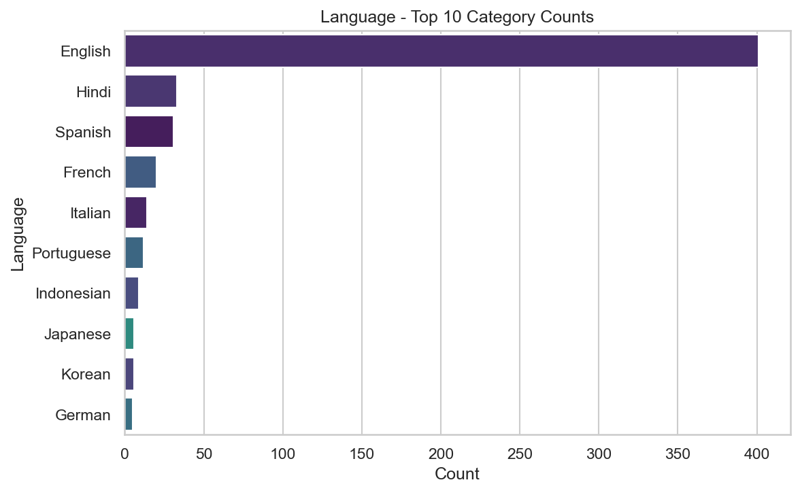
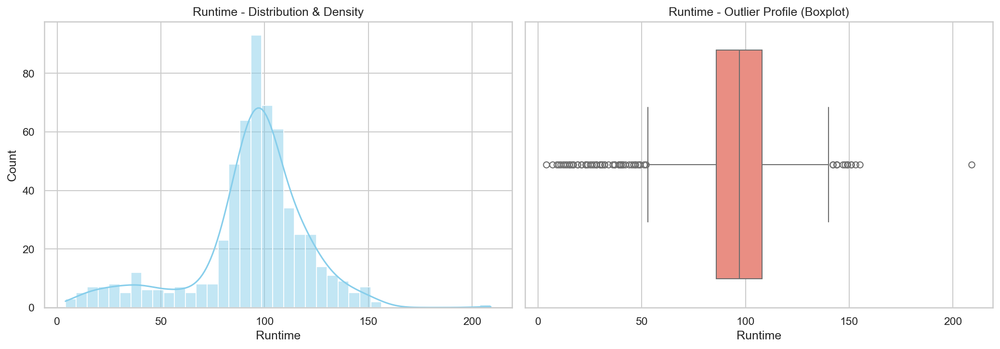
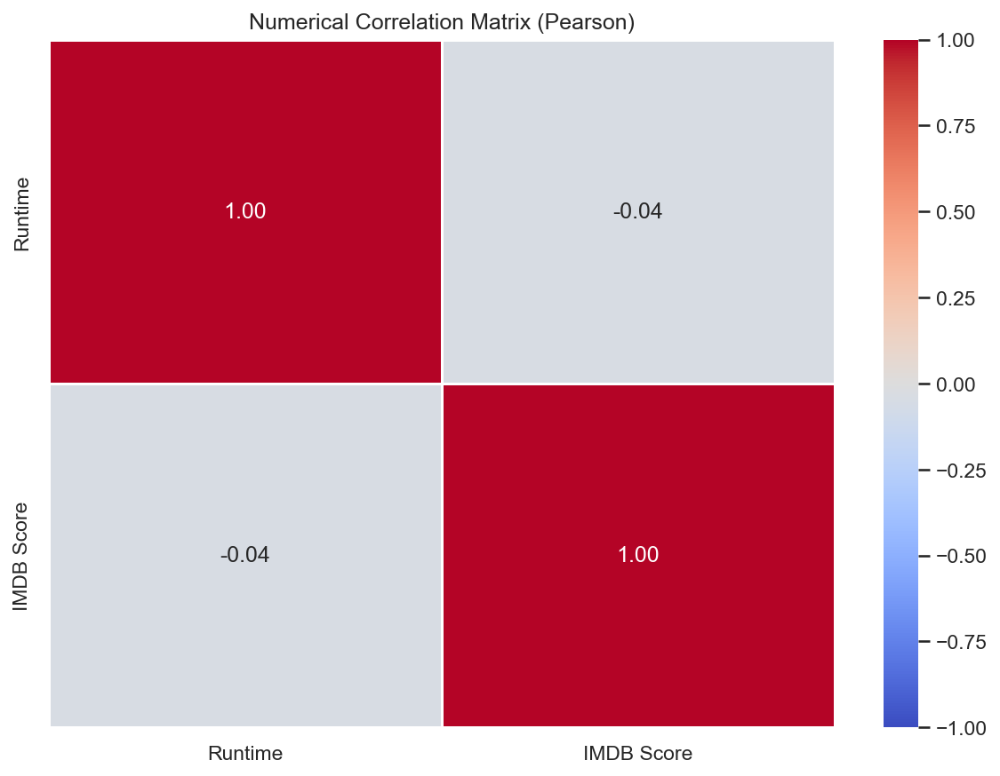

# 🎬 Netflix Originals Analysis

An exploratory data analysis (EDA) of the Netflix Originals dataset using **EDAEngine**, a custom Python package for automated data profiling, statistical analysis, visualization, and quality assessment.

The objective of this project is to analyze Netflix Original titles, their genres, languages, runtimes, IMDb ratings, and overall content characteristics before performing further recommendation or predictive modeling.

---

# Dataset Overview

The dataset contains **584 Netflix Original titles** with **6 features**.

## Feature Description

| Feature | Description |
|----------|-------------|
| Title | Name of the Netflix Original |
| Genre | Primary genre of the title |
| Premiere | Release date |
| Runtime | Duration (minutes) |
| IMDB Score | IMDb user rating |
| Language | Original language |

---

# Automated EDA Pipeline

This analysis was generated using **EDAEngine**, which automatically performs:

- Schema Detection
- Data Type Classification
- Missing Value Analysis
- Duplicate Detection
- Numerical Profiling
- Categorical Frequency Analysis
- Distribution Visualization
- Outlier Detection
- Correlation Analysis
- Automated JSON Report Generation

---

# Data Quality Summary

| Metric | Result |
|---------|--------|
| Missing Values | **0** |
| Duplicate Records | **0** |
| Data Gaps | None |

## Findings

- Complete dataset with no missing values.
- No duplicate records detected.
- Ready for visualization and downstream machine learning tasks with minimal preprocessing.

---

# Dataset Summary

| Metric | Value |
|---------|-------|
| Total Titles | **584** |
| Genres | **115** |
| Languages | **38** |

---

# Runtime Analysis

| Statistic | Value |
|-----------|------:|
| Mean Runtime | **93.58 min** |
| Median Runtime | **97 min** |
| Minimum | **4 min** |
| Maximum | **209 min** |

### Observations

- Most Netflix Originals have runtimes between **85–110 minutes**.
- Runtime distribution is slightly left-skewed due to a collection of very short titles.
- Approximately **12.8%** of titles are statistical outliers, primarily short films, documentaries, or unusually long productions.

---

# IMDb Score Analysis

| Statistic | Value |
|-----------|------:|
| Mean IMDb Score | **6.27** |
| Median | **6.35** |
| Minimum | **2.5** |
| Maximum | **9.0** |

### Observations

- Ratings approximately follow a bell-shaped distribution centered around **6–7**.
- Most Netflix Originals receive moderate audience ratings.
- Only **1.5%** of titles are statistical outliers, representing exceptionally high or low-rated productions.

---

# Language Distribution

Top languages in the dataset:

| Language | Titles |
|----------|-------:|
| English | **401** |
| Hindi | 33 |
| Spanish | 31 |
| French | 20 |
| Italian | 14 |

### Observations

- English dominates the Netflix Originals catalog, accounting for nearly **69%** of all titles.
- The remaining catalog spans **38 languages**, highlighting Netflix's global production strategy.

---

# Genre Analysis

| Metric | Value |
|---------|------:|
| Unique Genres | **115** |
| Most Common Genre | Documentary |
| Documentary Titles | **159** |

### Observations

- Genre diversity is high with **115 unique genres**.
- Documentary is the most frequently occurring genre, representing over one-quarter of the dataset.
- The high genre cardinality reflects Netflix's broad content portfolio.

---

# Correlation Analysis

Pearson Correlation Matrix

| Features | Correlation |
|-----------|------------:|
| Runtime ↔ IMDb Score | **-0.04** |

### Key Findings

- Runtime has virtually **no linear relationship** with IMDb ratings.
- Longer movies do not necessarily receive higher ratings.
- Feature independence suggests runtime alone is not a useful predictor of audience satisfaction.

---

# Outlier Summary

| Feature | Outliers |
|----------|---------:|
| Runtime | **75 (12.84%)** |
| IMDb Score | **9 (1.54%)** |

Most runtime outliers correspond to very short productions or unusually long feature films rather than erroneous records.

---

# Visualization Gallery

## Language Distribution



---

## Runtime Distribution



---

## IMDb Score Distribution


---

## Correlation Matrix



---

# Key Insights

- Dataset contains **584 Netflix Originals**.
- No missing values or duplicate records.
- Netflix Originals are produced in **38 different languages**.
- English titles comprise approximately **69%** of the catalog.
- Documentary is the most common genre.
- Typical runtime is around **95 minutes**.
- IMDb ratings cluster around **6–7**, indicating generally moderate audience reception.
- Runtime exhibits virtually **no correlation** with IMDb ratings.
- Genre diversity is high, with **115 unique categories**.

---

# Files Generated by EDAEngine

```
plots/
├── categorical_Language.png
├── numerical_Runtime.png
├── numerical_IMDB Score.png
└── numerical_correlation.png

automated_report.json
```

---

# Conclusion

The Netflix Originals dataset is a clean and diverse collection of films spanning multiple genres and languages. Automated analysis using **EDAEngine** reveals excellent data quality, substantial language diversity, and a wide range of runtime characteristics. While runtime shows little influence on IMDb ratings, the dataset offers valuable opportunities for genre analysis, recommendation systems, content clustering, and predictive modeling.

---

# Built With

- Python
- Pandas
- NumPy
- Matplotlib
- Seaborn
- EDAEngine (Custom Automated EDA Library)